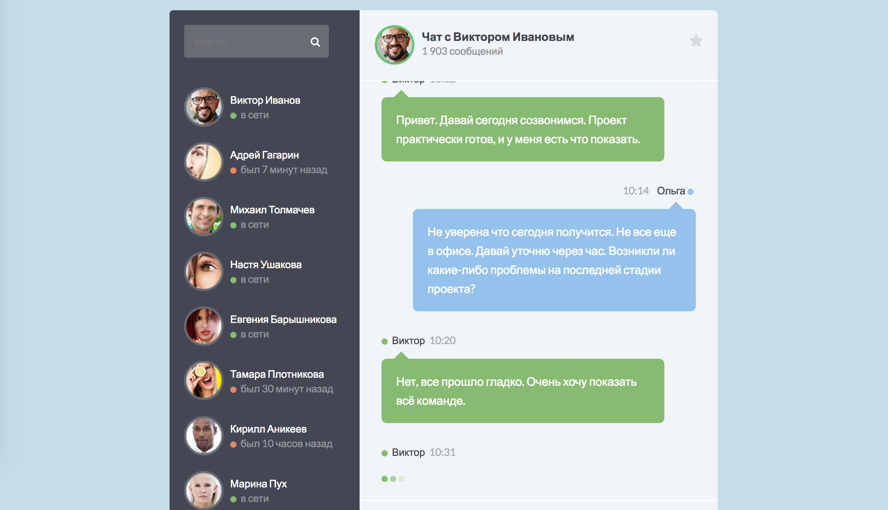
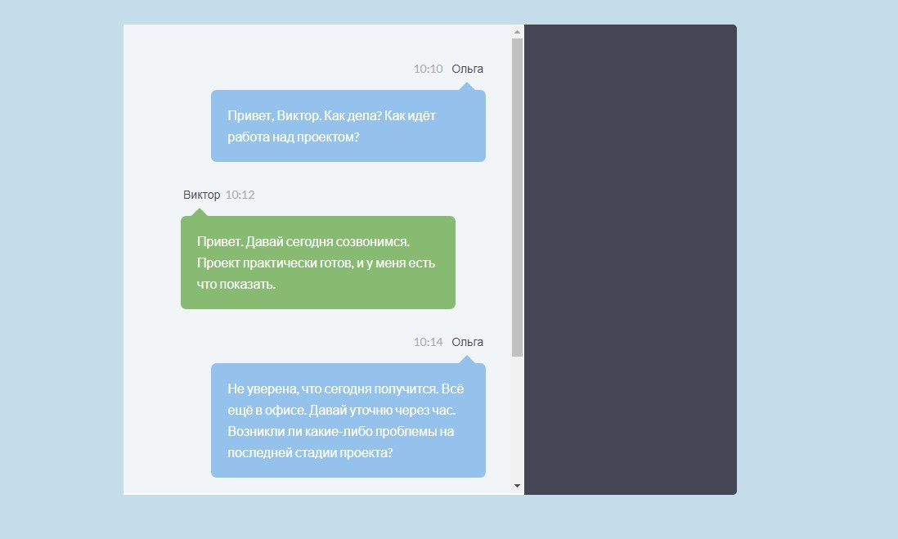

# История чата

Учебный проект курса [React для JS-разработчиков](https://netology.ru/programs/react)

## **Задача**

Реализация одного из компонентов чата — истории сообщений:



## **Описание компонента**

Список сообщений, передаваемый в компонент, представляет собой массив объектов, каждый из которых представляет собой сообщение, которое необходимо отразить в истории. Сообщение имеет следующие свойства:

* `id` — уникальный идентификатор сообщения, строка;
* `from` — автор сообщения, объект;
* `type` — тип сообщения, строка, варианты значений: response, message, typing;
* `time` — время публикации сообщения, строка;
* `text` — текст сообщения, строка, может отсутствовать.

Для отображения списка создан компонент `MessageHistory`, который принимает следующий атрибут:

* `list` — список сообщений, массив объектов, по умолчанию пустой массив.
Если список сообщений пуст, то компонент не должен иметь какого-либо представления в DOM.

Компонент создает на основе списка предложений следующий HTML-код:

```JavaScript
<ul>
  <li class="clearfix">
    <div class="message-data align-right">
      <span class="message-data-time">10:10</span> &nbsp; &nbsp;
      <span class="message-data-name">Ольга</span>
      <i class="fa fa-circle me"></i>
    </div>
    <div class="message other-message float-right">
      Привет, Виктор. Как дела? Как идёт работа над проектом?
    </div>
  </li>
  <li>
    <div class="message-data">
      <span class="message-data-name"><i class="fa fa-circle online"></i> Виктор</span>
      <span class="message-data-time">10:12</span>
    </div>
    <div class="message my-message">
      Привет. Давай сегодня созвонимся. Проект практически готов, и у меня есть что показать.
    </div>
  </li>
  <!-- … и так далее -->
</ul>
```
Где каждый тег `<li>` — сообщение из массива. Для отображения сообщений в чате используются следующие компоненты:

* `Message` — если тип сообщения равен message;
* `Response` — если тип сообщения равен response;
* `Typing` — если тип сообщения равен typing.
Все три компонента принимают следующие аргументы:

* `from` — автор сообщения, объект;
* `message` — сообщение, объект.
## **Стек технологий**


## [**Демо**](https://chat-sand-three.vercel.app/)

